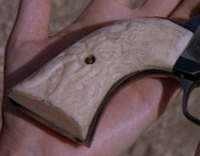
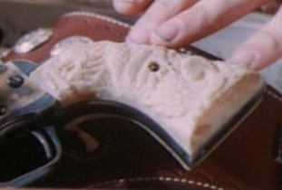

## The Adventures of Brisco County Jr

3D Scans of replica (or original) grips from the TV show.

    "Just an ordinary peacemaker with a pretty handle.
    That doesn't make it shoot any straighter."

    -- R. Lee Ermey as Brisco Country, Sr.

Open an [issue](https://github.com/durgadas311/Brisco/issues)
to share progress or ask questions. Or contact me directly.

[A GRIPping story](TheStory.md)

Scan files and zip are [here](http://sebhc.durgadas.com/Brisco/Grips/3DScan/)

Grips found at estate sale:

Shots from the TV show:

