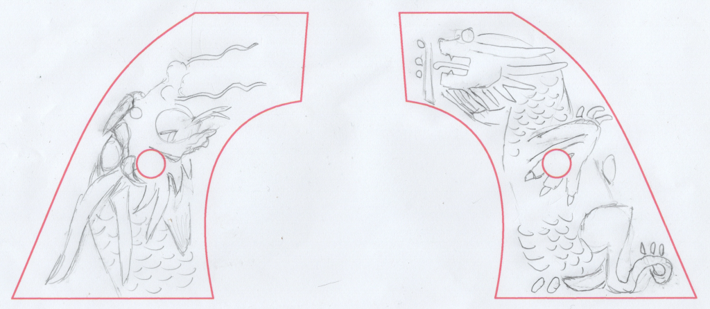

## The Story Of The Grips

While re-watching "The Adventures of Brisco County Jr" for the emteenth time,
I wondered what the grips on Brisco's iconic peacemaker actually looked like.
I also wondered if anyone had made reproductions of them.
A search led me to
[this old post](https://www.therpf.com/forums/threads/brisco-county-jr-peacemaker.76110/)
on Replica Props Forum (RPF), but I could not access any attachments
(probably due to the age).
So I loaded up my DVDs for screenshots and started over, and created a
[new thread](https://www.therpf.com/forums/threads/brisco-county-jr-peacemaker-grips.358560/).

From framegrabs of the show, and the assertion that they depicted dragons,
I was able to get a rough idea what the grips
might have looked like and sketched this:

After hitting a wall on finding someone to try and carve
a replica or create a computer model, I set this aside.

Not long after, I get a message from Joe B. in Florida saying he just
purchased a peacemaker with custom grips at an estate sale and was researching its
history and ran across my RPF posts and noticed they were similar.
Lo and behold, the grips on his peacemaker are nearly exactly what
I had sketched. It was a near certainty that his peacemaker was
associated in some way with the TV show. He was only able to find out
that the estate sale was for "a Hollywood producer" but nothing more.
Still, that alone is compelling.

After more detailed photos and a noble attempt by RPF member JOATRASH/FX
to create replicas,
Joe decided to risk sending me the grips for further analysis.
I was amazed to find that these grips are actually carved out of real ivory.
The fact that they were not some molded plastic thing was even more
compelling, and I sought more info on the peacemaker itself to try
and determine the history.

The peacemaker was made by USFA, a U.S. firearms manufacturer in business
between 1993 and 2017 that specialized in Colt-style "Single Action Army"
revolvers (M1873, the "peacemaker"). To the best of my ability, I was able to narrow
down this revolver to between 1997 and 2008.
Since the TV show was in production only around 1993,
that places the actual revolver outside of the timeframe of TV show.
However, the DVD release of the show was in 2006 and there was a significant reunion
during production of the DVD "extras" (probably 2005).

So, two theories came to mind: 1) This piece was created as part of
or related to the work on the DVD release,
or 2) These grips pre-date the revolver and the revolver
was customized to fit the grips (usually it's the other way around).
In support of theory 2 is the fact that the backstrap looks different than
the rest of the gun, and it's serial number is scratched-in instead of being stamped
on like the other parts. So, I think there's still a chance that the grips
were the masters for the TV show
(and the revolver was custom-fit to them later).
It's even possible that these grips predate the show, being found in some
Warner Bros prop warehouse or even coming from outside the studio.

These grips were definitely not the actual ones seen on the TV show, as
the show grips were of the "two piece" design, having the mounting screw in them.
These grips are of the "one piece" design, where the two halves are glued to
a spacer and are held in place by the backstrap. The exact methods used
to create TV/movie props is not known to me, but it seems possible that
some "master" grips would have been found/created and then plastic replicas would be
crafted for use on the show - where things easily get broken or damaged. Plus, likely
multiple pistols were used for various situations
(firing, non-firing, stunts, sinking to the bottom of the lake at Gravesend, ...).

After many attempts to make silicone molds and resin castings of the grips,
I reached the conclusion that my skills, and techniques, were not adequate
to create quality replicas of these rather detailed, high-relief, carvings.
In addition, peacemaker grips are rarely the exact same size/shape
(they are close, but not exact enough that these grips fit the revolver I have).
So, I needed a new plan on how to make copies.

I did find a company near by that can create 3D scans of objects. So I hand-carried
these grips to them and had scans made. This seems to have worked great,
however I did not have the machinery to use those scans and replicate the grips.
I made a small investment in 3D printing equipment, and have had limited
luck creating something (these printers require a lot of calibration,
and I have not invested the time yet to get that right). I also am
on the steep end of the learning curve for 3D modeling software and how
to modify the 3D model to fit other pistols. So, things are a bit
stalled.
